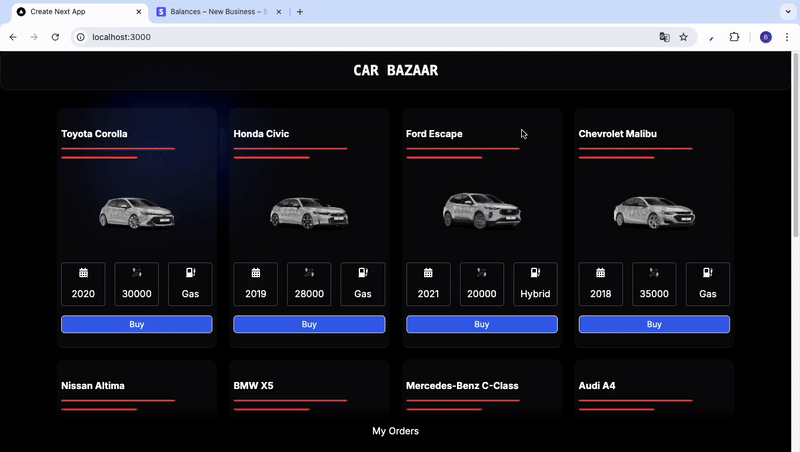

<h1>CAR BAZAAR</h1>

Car Bazaar is a web application developed using Next.js, with data stored in MongoDB. The platform integrates Stripe for secure and efficient payment processing, ensuring a smooth transaction process for all users.

<h2> Software Languages </h2>

- HTML

- CSS

- JavaScript

<h2> Libraries </h2>

- React

- Mongoose

<h2> Framework </h2>

- Next JS

- Tailwind CSS

<h3> Minor Libraries </h3>

- React Icons

- Millify

<h2> Screen Gif </h2>

